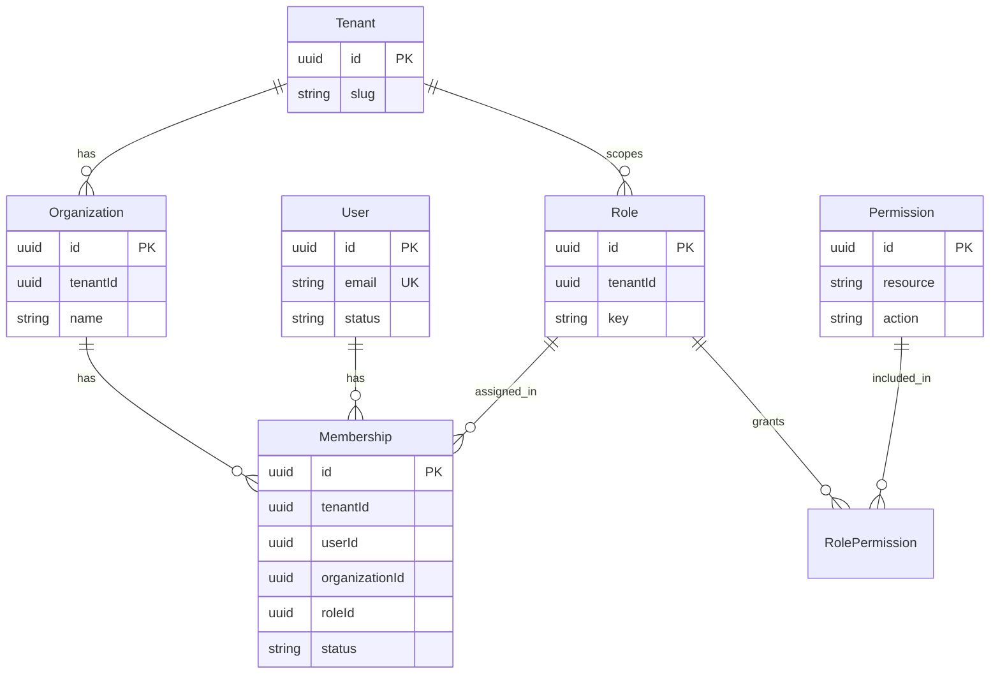

# Authorization Model — User, Membership, Role, Permission

**Статус:** Draft (2026-06-16) — **утвердить до написания кода User**  
**Контекст:** Platform + Users + RBAC · дополняет `012-foundation-domains.md`, ADR-003  
**Уже реализовано (CI_GREEN):** Tenant, Organization

---

## 1. Зачем этот документ

User — начало системы безопасности. Ошибка здесь (например `User.roleId`) через полгода
потребует миграции всей RBAC.

**Правило:** сначала зафиксировать модель доступа целиком, затем кодировать агрегаты
по одному с CI_GREEN на каждый.

**Цель MVP:** менеджер по продажам не теряет клиента после звонка — доступ должен
поддерживать «один человек — несколько организаций — разные роли», без переделок.

---

## 2. Иерархия и границы

```
Tenant (арендатор SaaS)
  └── Organization (компания клиента внутри tenant)
        └── Membership (участие User в Organization + Role)
              ├── User (личность, без roleId)
              └── Role (набор Permission в scope tenant/organization)
                    └── Permission (resource × action)
```

### Что НЕ делаем

| Анти-паттерн | Почему плохо |
|--------------|--------------|
| `User.roleId` | один user не может быть Manager в Org A и Admin в Org B |
| `User.tenantId` как единственная привязка | смешивает identity и membership |
| Role без scope | непонятно, где роль действует |
| Permission на User напрямую | обход Role, неконтролируемый рост прав |

### Правильная цепочка проверки прав

```
Request → JWT (userId) → Membership (org context) → Role → Permissions → Guard / Repository filter
```

---

## 3. Сущности — что хранит каждая

### Tenant *(реализован ✅)*

| Поле | Тип | Назначение |
|------|-----|------------|
| id | UUID | PK |
| name, slug | string | идентификация арендатора |
| plan, status | enum | тариф, ACTIVE/SUSPENDED |
| version, timestamps, deletedAt | ADR-012 | optimistic lock, soft delete |

**Ответственность:** граница данных SaaS (RLS `tenant_id`). Не знает User/Role.

---

### Organization *(реализован ✅)*

| Поле | Тип | Назначение |
|------|-----|------------|
| id | UUID | PK |
| tenantId | UUID | FK логический → Tenant |
| name | string | название компании |
| inn | string? | реквизиты (10/12 цифр) |
| settings | json | org-level настройки |
| version, timestamps, deletedAt | ADR-012 | |

**Ответственность:** бизнес-единица внутри tenant (карточка «компания клиента»).
Не знает User напрямую — только через Membership.

---

### User *(следующий агрегат — после утверждения)*

| Поле | Тип | Назначение |
|------|-----|------------|
| id | UUID | PK, глобальная личность |
| email | string | **уникален глобально** (один аккаунт — один email) |
| name | string | отображаемое имя |
| status | enum | INVITED \| ACTIVE \| DISABLED (глобальный статус аккаунта) |
| lastLoginAt | datetime? | обновляется Auth |
| version, timestamps, deletedAt | ADR-012 | |

**Не хранит:** `tenantId`, `roleId`, `organizationId`, `passwordHash` (→ Auth/Credential).

**Методы домена:** `invite()`, `activate()`, `disable()`, `rename()`, `changeEmail()`.

**События:** `UserInvited`, `UserActivated`, `UserDisabled`, `UserRenamed`, `UserEmailChanged`.

> **Решение:** email уникален **глобально**, не per-tenant. Один User входит в несколько
> Organization через Membership. Это упрощает login и соответствует сценарию
> «консультант работает с двумя компаниями».

*Альтернатива (отклонена для MVP):* email unique per tenant — усложняет Auth и дублирует
identity. Вернуться можно через отдельный ADR.

---

### Membership *(контекст доступа — до Role в коде)*

| Поле | Тип | Назначение |
|------|-----|------------|
| id | UUID | PK |
| tenantId | UUID | RLS + denormalize для запросов |
| userId | UUID | → User |
| organizationId | UUID | → Organization |
| roleId | UUID | → Role (роль **в этой** organization) |
| status | enum | PENDING \| ACTIVE \| SUSPENDED \| REVOKED |
| invitedAt, joinedAt | datetime? | онбординг |
| version, timestamps, deletedAt | ADR-012 | |

**Уникальность:** `@@unique([userId, organizationId])` — один user, одна membership на org.

**Ответственность:** единственное место, где User связан с Role и Organization.
Именно Membership попадает в JWT/session context при работе «от имени организации».

**Методы:** `invite()`, `accept()`, `suspend()`, `revoke()`, `changeRole(roleId)`.

**События:** `MembershipInvited`, `MembershipActivated`, `MembershipRevoked`, `MembershipRoleChanged`.

**Инварианты:**
- Organization.tenantId == Membership.tenantId
- Role.tenantId == Membership.tenantId (или role scoped to same tenant)
- нельзя revoke последнюю ACTIVE Membership с Role=Owner в Organization *(когда Role будет)*

---

### Role

| Поле | Тип | Назначение |
|------|-----|------------|
| id | UUID | PK |
| tenantId | UUID | scope tenant (системные роли per-tenant) |
| key | string | OWNER \| ADMIN \| MANAGER \| VIEWER \| custom slug |
| name | string | «Менеджер» |
| isSystem | boolean | нельзя удалить системные |
| version, timestamps, deletedAt | ADR-012 | |

**Не хранит:** userId. Связь User↔Role **только** через Membership.

**Системные роли (seed per tenant):** Owner, Admin, Manager, Viewer — см. ADR-003 §5.

---

### Permission

| Поле | Тип | Назначение |
|------|-----|------------|
| id | UUID | PK |
| resource | string | `deals`, `contacts`, `organizations`, … |
| action | string | `read`, `create`, `update`, `delete`, `assign` |

**Связь M:N:** `RolePermission(roleId, permissionId)` — права назначаются Role, не User.

**Примеры:** `deals:read`, `deals:update`, `contacts:create`, `calls:record`.

**Проверка:** `@RequirePermission('deals','update')` → JWT userId → active Membership → Role → permissions[].

**«Только свои» для Manager:** не Permission, а фильтр репозитория CRM по `ownerUserId` (ADR-003).

---

## 4. Диаграмма связей



| Связь | Кардинальность | Комментарий |
|-------|----------------|-------------|
| Tenant → Organization | 1:N | org всегда в одном tenant |
| User → Membership | 1:N | один user, много org |
| Organization → Membership | 1:N | много users в org |
| Membership → User | N:1 | |
| Membership → Role | N:1 | роль **в контексте** org |
| Role → Permission | N:M | через RolePermission |

---

## 5. Сценарий: один User — две Organization — разные Role

**Алексей** (`user@corp.ru`, User.id = U1)

| Organization | Membership | Role |
|--------------|------------|------|
| ООО «Альфа» (Org A) | M1 | MANAGER |
| ООО «Бета» (Org B) | M2 | ADMIN |

**Login:** Auth выдаёт JWT с `sub=U1`, без role (role не на User).

**Выбор контекста:** клиент передаёт `X-Organization-Id: Org A` (или UI switcher).

**API request:** Guard загружает Membership(U1, Org A) → Role MANAGER → permissions.

**Переключение на Org B:** тот же JWT, другой `organizationId` → ADMIN → другие permissions.

✅ Модель поддерживает сценарий без `User.roleId`.

---

## 6. Auth (отдельный контекст — не смешивать с User)

| Сущность | Где | Назначение |
|----------|-----|------------|
| Credential | `packages/auth` | userId + passwordHash (Argon2id) |
| Session | Redis | sessionId, userId, optional activeOrganizationId, refresh |

**JWT claims (access):** `sub` (userId), `tenantId` (active tenant), `orgId` (active org, optional), `membershipId` (optional).

Refresh/session — ADR-003 §4. Роли в JWT — **кэш** permissions snapshot, источник истины — Membership+Role в БД.

---

## 7. Порядок реализации (Golden Path)

После **утверждения** этого документа:

```
1. User           — identity only, no roleId
2. Membership     — user ↔ organization ↔ role
3. Role           — system roles seed per tenant
4. Permission     — RolePermission matrix
5. Audit          — audit_logs (ADR-003 §6)
```

Каждый шаг: Entity → Prisma → CQRS → tests → **CI_GREEN** → DONE.

**Auth** (login/session) — параллельно или сразу после User+Membership, до CRM.

---

## 8. Первый end-to-end бизнес-сценарий (North Star)

Не только Platform — первый **вертикальный** сценарий продукта:

```
1. Create Tenant
2. Create Organization
3. Invite User          → User + Membership (PENDING)
4. User accepts / Login → Auth + Membership ACTIVE
5. Create Contact       → CRM (Manager permission)
6. Make Call            → Telephony
7. AI Summary           → AI service (текст, не решения)
8. Task auto-created    → Tasks (из summary)
```

Platform (Tenant, Org, User, Membership, Role) — **фундамент** для шагов 1–4.  
CRM + Telephony + AI — следующие vertical slices **после** RBAC MVP.

---

## 9. API (черновик)

### User
```
POST /users/invite          { email, name, organizationId, roleId }  → User + Membership
GET  /users/{id}
PATCH /users/{id}
POST /users/{id}/disable
```

### Membership
```
GET  /memberships?organizationId=
GET  /memberships?userId=
PATCH /memberships/{id}     { roleId }
POST /memberships/{id}/revoke
POST /memberships/{id}/accept
```

### Role / Permission
```
GET  /roles
POST /roles/{id}/permissions
GET  /users/me/permissions    (effective, via active Membership)
```

Invite создаёт **оба** агрегата: User (если email новый) + Membership — оркестрация в application layer, домены не сливаются.

---

## 10. Контексты (packages)

| Контекст | Агрегаты |
|----------|----------|
| `packages/platform` | Tenant, Organization *(done)* |
| `packages/users` | User |
| `packages/rbac` | Membership, Role, Permission, RolePermission |
| `packages/auth` | Credential, Session (Redis) |

Membership логически в RBAC (связывает User и Role), но invite-flow координирует Users module.

---

## 11. Отличия от `012-foundation-domains.md`

| Было в 012 | Стало |
|------------|-------|
| User.tenantId | **Убрано** — tenant через Membership |
| UserRole M:N | **Заменено** на Membership.roleId |
| AssignRole на User | **AssignRole** = `Membership.changeRole()` |
| email unique per tenant | **email unique global** (MVP) |

После утверждения — обновить `012-foundation-domains.md` одним `docs:` commit.

---

## 12. Чеклист утверждения

- [ ] User не содержит roleId / organizationId / tenantId
- [ ] Membership — единственная связь User ↔ Organization ↔ Role
- [ ] Сценарий «Manager в A, Admin в B» описан и выполним
- [ ] Permission только через Role
- [ ] Порядок кодирования: User → Membership → Role → Permission → Audit
- [ ] Auth/Credential отделены от User aggregate

**Утверждает:** владелец продукта  
**После утверждения:** начать `feat(users): add User aggregate` (только User, без Membership)
